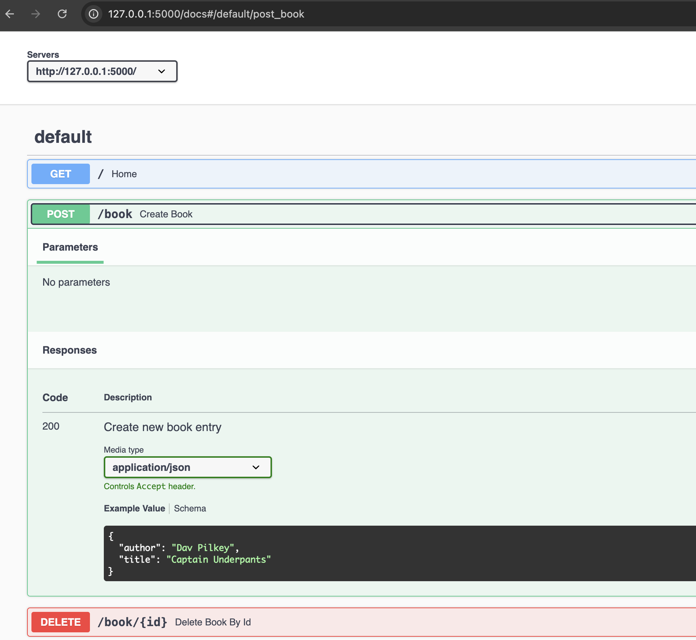
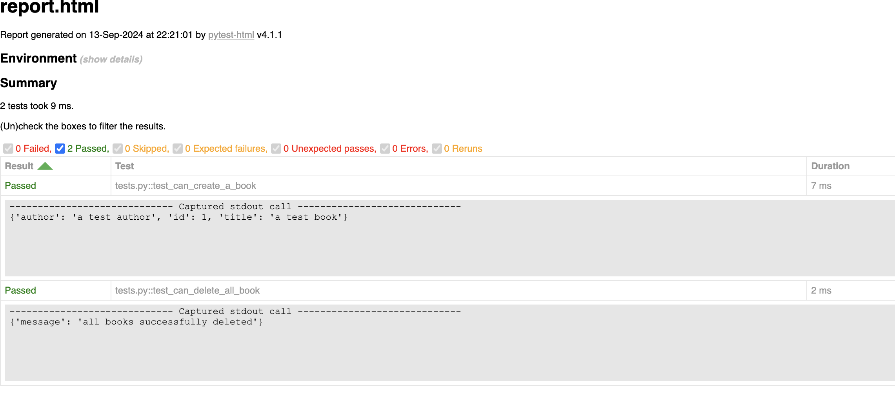

# python flask API

- [Stack](#stack)
- [Run](#run)
- [API docs](#api-docs)
- [Tests](#tests)
  - [TODO](#todo)

A basic full-stack app using Python, apiflask and good ol' html.

## Stack

- web framework: https://flask.palletsprojects.com/en/3.0.x/
- api docs: https://apiflask.com/usage/
- db: https://www.sqlite.org/

## Setup venv

> [!NOTE]
> Install python dependencies in a virtual sandbox to isolate any impacts to host system.

1. `python -m venv .`
  - this will generate a `./bin`, `./include`, `./lib` and `./pyvenv.cfg` in your chosen directory (`.` in this case)
2. `source bin/activate` to activate the virtual environment
3. `pip install -r requirements.txt` to install all dependencies from `./requirements.txt`

## Run

1. `python src/app.py`
2. head to `http://127.0.0.1:5000` for app (root `/` is the web app)

> [!TIP]
> Change local host above to any address of your choice by editing `src/app.py`

## API docs

1. `python src/app.py`
2. head to `http://127.0.0.1:5000/docs` for locally hosted OpenAPI spec (auto generated)
3. run `flask spec` to generate an OpenAPI 3.0 spec, which can be used to host elsewhere

> [!WARNING]
> not all routes contain the same level of information as apiflask was being explored

## Tests

1. in 1 process, start the server `python src/app.py`
2. in a 2nd process, run the tests `pytest tests/tests.py --html=./report.html`

- assertion examples - https://naodeng.medium.com/pytest-tutorial-advance-usage-common-assertions-and-data-driven-e72122b9ec48

## Future additions

- https://apiflask.com/tips/ - run behind reverse proxy

## References
- https://github.com/apiflask/apiflask
- https://medium.com/@nileshshindeofficial/in-this-blog-well-explore-how-to-use-flask-with-sqlite-a-lightweight-and-easy-to-use-database-c302cd939a0f
- https://www.sqlitetutorial.net/sqlite-python/